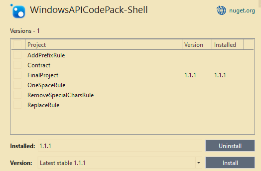
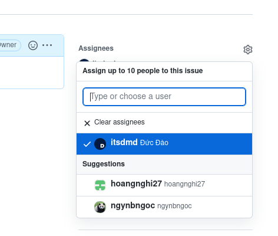
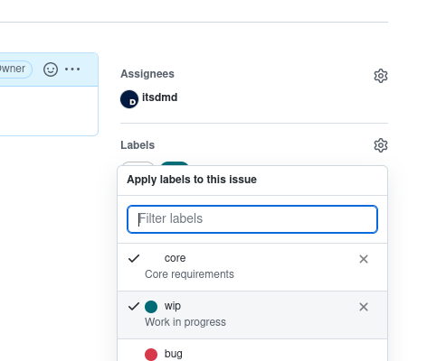
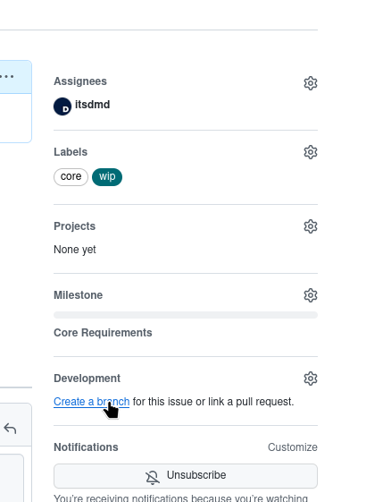
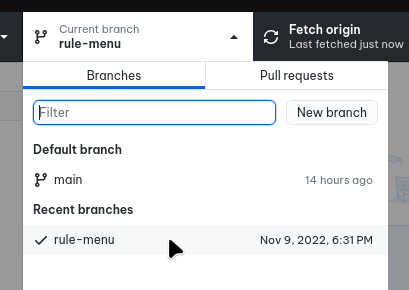
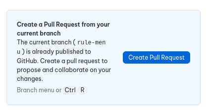
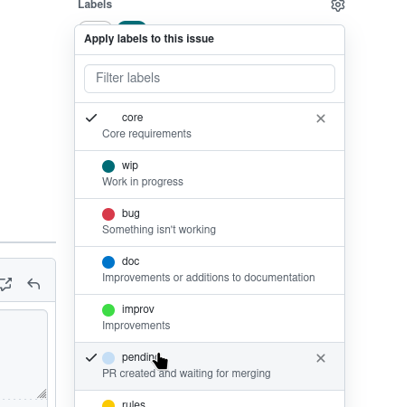

> ### [Project Requirements](https://tdquang7.notion.site/Project-batch-rename-2022-9dc9eb9c9d674dbdb4a988a3794d1335)

# Setup
1. Use Visual Studio 2022 with **.NET 7.0** installed.

2. Pull the repo using GitHub Desktop.

3. Open the project in VS.

4. Make sure to use **Debug** build mode.

5. *Tools > NuGet Package Manager > Manage ... > Installed*.

6. Check if `WindowsAPICodePack-Shell` had been installed for **FinalProject** (if not, install it).

7. ***Clean solution** > Build solution*. Copy all **.dll files** of every plugin into FinalProject's Debug folder (`FinalProject\bin\Debug\net6.0-windows`)

8. Pray that it runs :smiling_face_with_tear:

# Contribute
1. On [GitHub website](https://github.com/itsdmd/CS202-Final), go to [**Issues**](https://github.com/itsdmd/CS202-Final/issues).

2. Find an issue you want to work on. If it's not there, create one.

3. Click on the issue and self assign.

---

4. Add `wip` label.

---

5. Create a branch with a short descriptive name (eg. 'Adding a suffix' > 'suffix' as branch name).

---

6. In GitHub Desktop, switch to the branch you just created and start editing.

---

7. After finish editing, commit and push all changes. After that, create a PR.

---

8. Remove `wip` label and add `pending` label.

